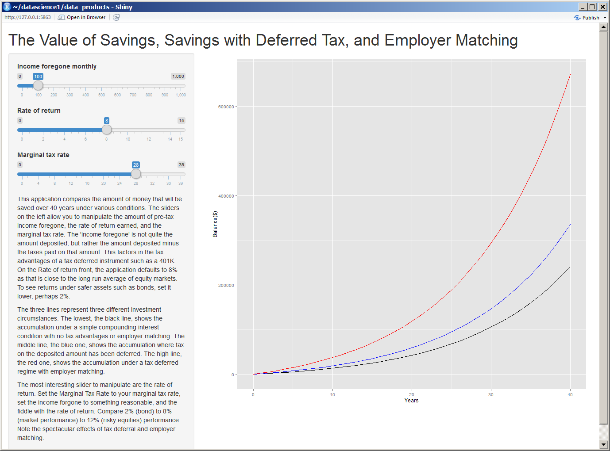
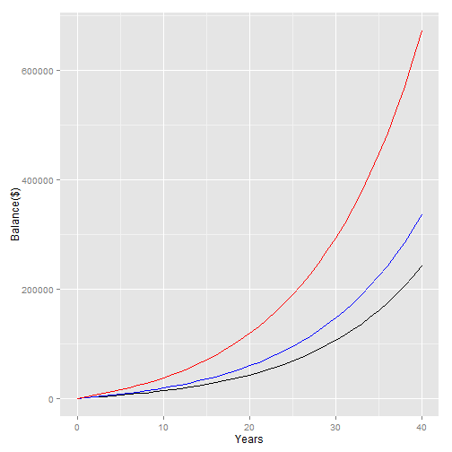

## Saving for Retirement
* Everyone should save for retirement
* Most of us prioritize savings lower than today's expenses
* Saving modest amounts today can have real effects in the long term
* Different retirement plans can yield spectacularly different results
* A tool to visualize compounding accumulation and the effects of different plans would be helpful

---

## Different Retirement Plans
* Basic Savings - This is a basic savings account with no tax andvantage or employer matching, yet the power of compounding interest makes it powerfull nonetheless. 

* Tax deferred - This is a instrument that allows the saver to deposit pre-tax money rather than post-tax money. For example, if a saver makes $5000 per month and saves $500 each month, the saver will only be taxed on $4500. This means that the saver makes a return of amount saved times the incremental tax rate IMMEDIATELY. If the above saver is in the 28% bracket, that would be $140 per month. This means that the saver is foregoing only $360 in income but saving $500. 

* Employer matched - This usually builds on a tax deferred account. Here the saver's employer matches the saver's deposit, usually with a cap. In the above scenario, if the employer would match up to five percent, the saver would forego the same $360, but achieve $500 + $250 = $750 in savings -- an immediate 100% return! 

---
## A Tool to Visualize
While numbers are nice, a visual tool to see the effects of compounding returns and the advantages tax deferred/employer matching retirement accounts would really help. 

---
## Net Effect
The effect of compounding returns means even modest savings over 40 years can result in a significant amount of money being saved. Tax deferred accounts and employer matching are so advantageous that they are like find money on the ground. 
 
---

